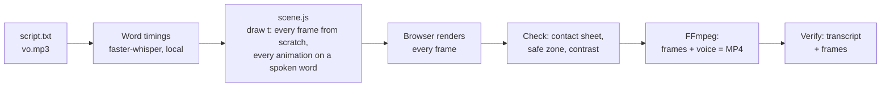

# zero-editor-video

**Make videos with your AI agent in code alone. No video editor, no Remotion, no HyperFrames.**

Works with Claude Code · Codex · Cursor · Gemini CLI · GitHub Copilot, or any agent that reads `AGENTS.md` or Agent Skills (`SKILL.md`).

---

Video frameworks for AI agents are everywhere right now. You don't need one:
- **Remotion** is free only for small teams. Companies of 4+ people need a paid licence.
- **HyperFrames** runs free on your computer, but HeyGen's own voices, music and cloud rendering need a HeyGen account.

A web browser can already draw every frame, and FFmpeg (free) can join the frames into a video. Your agent just has to write the code in between. Every reel on my channel is made this way.

## How it works



1. **You give the agent your script and your voiceover**, so it knows exactly when every word is spoken.
2. **The agent writes the animation as code** and draws every frame in the browser, timed to your words.
3. **FFmpeg joins the frames and the voice into one video**, and the agent checks it before you post it.

## Quick start

You need **Node.js 18+**, **Python 3.10+** and **FFmpeg**. All are free.

```bash
git clone https://github.com/krisuuu2/zero-editor-video
cd zero-editor-video
```

Put your `script.txt` and `vo.mp3` in the folder, open it in your agent and say **"make my video"**. In Claude Code, the skill loads by itself.

**No repo?** Copy the prompt from [`PROMPT.md`](PROMPT.md) into any agent, in an empty folder.

**Use it everywhere:** copy `.agents/skills/zero-editor-video` into your agent's skills folder, for example `~/.claude/skills/` or `~/.codex/skills/`.

## What's inside

```
PROMPT.md                 the copy-paste prompt
AGENTS.md                 shared instructions (CLAUDE.md and GEMINI.md import it)
.agents/skills/…          the Agent Skill for Codex, Gemini CLI, Copilot, Cursor
.claude/skills/…          the same skill for Claude Code
```

## What it is, and what it isn't

- **It is** a method your agent follows to build a small, deterministic render pipeline in your own folder. The code is yours.
- **It isn't** a library or a template pack. The first video takes a little back-and-forth while you and the agent settle on a look. After that, every video reuses the pipeline.
- It doesn't generate footage from a prompt. It animates your script, your voice, real screenshots and your own images.

---

Made by **Kris**: AI automations you can use today.
YouTube **[Kris | AI, Practically](https://www.youtube.com/@aipracticallykris)** · Instagram **[@aipractically](https://www.instagram.com/aipractically/)** · also by me: [zero-dollar-seo](https://github.com/krisuuu2/zero-dollar-seo).
Not affiliated with Remotion, HeyGen or Anthropic. MIT licensed.
